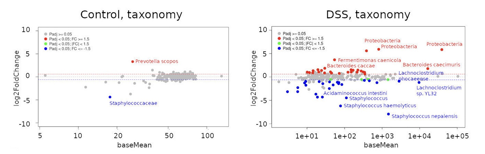
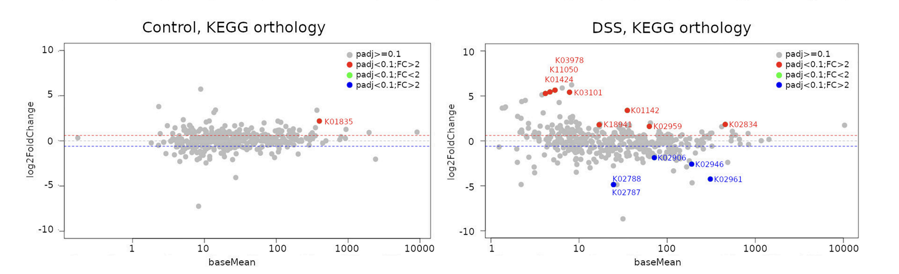

# Shotgun metagenomics changes associated with inflammation in the mice gut

## Index

[Description of project](#Description of project)
  [Description de samples](#Description of samples)
[Data analysis](#Data analysis)
  [Taxonomic classification](#Taxonomic classification)
  [Functional profiling](#Functional profiling)

## Description of project

Shotgun metagenomics studies have improved our understanding of microbial population dynamics and have revealed significant contributions of microbes to gut homeostasis. They also allow in silico inference of the metagenome. While they link the microbiome with metabolic abnormalities associated with disease phenotypes, they do not capture microbial gene expression patterns that occur in response to the multitude of stimuli that constantly ambush the gut environment.

### Description of samples

__Table 1.__ Metadata of samples included in the project.

|sample | animal | group |
|-------|--------|-------|
|CA5E   |	5      |	01_control|
|CA4E   |4      |	01_control|
|CA3E   |	3      |	01_control|
|CA2E   |	2      |	01_control|
|CA1E   |	1      |	01_control|
|TA5E   |	5      |	02_DSS    |
|TA4E   |	4      |	02_DSS    |
|TA3E   |	3      |	02_DSS    |
|TA2E   |	2      |	02_DSS    |
|TA1E   |1      |  02_DSS    |


| Sample Name | Group |
|------|--------|
| Alice | [@aliceGH](https://github.com/aliceGH) |
| Bob   | [@bobGH](https://github.com/bobGH) |


## Data analysis

Data analysis included two main parts: Taxonomic classification, which was conducted with [kraken2]( https://github.com/DerrickWood/kraken2/blob/master/docs/MANUAL.markdown), while functional profiling was conducted with [HUMAnN3]( https://huttenhower.sph.harvard.edu/humann/). 

### Taxonomic classification

Kraken2 and using a custom database that included the RefSeq database of NCBI and GTDB.

The kraken2 algorithm was essentially run using the following code:

```bash
  for FILE in *_R1_001.fastq.gz 
    do 
      kraken2 --db $DB \
      --threads 48     \ 
      --use-mpa-style  \ 
      --memory-mapping \
      --confidence 0.1 \
      --report ${FILE/_R1_001.fastq.gz/}_mpa.tax \
      $FILE ${FILE/_R1_001.fastq.gz/_R2_001.fastq} \
      --output ${FILE/_R1_001.fastq.gz/}.krk2
    done

```

The following figure illustrate statistically significant taxa abundance that changed in response to inflammation. .

__Figure 1.__ MA plots depicting taxonomic differential accumulation analysis results for control (left panel) or DSS-treated (right panel) animals. 

### Functional profiling

HUMAnN3 with the UniRef90 and ChocoPhlan databases were used for functional profiling of only End1 sequences of each sample. 

The HUMAnN3 algorithm was essentially run using the following code:

```bash
   for FILE in *_R1_001.fastq.gz
    do 
      humann --input $FILE --output ${FILE/_R1_001.fastq.gz/}_humann_output --threads 24
    done
```


The following figure illustrate statistically significant KEGG pathways that were differentially enriched during inflammation. .

__Figure 2.__ MA plots depicting KEGG orthology differential abundance analysis results for control (left panel) or DSS-treated (right panel) animals.


| Name | GitHub |
|------|--------|
| Alice | [@aliceGH](https://github.com/aliceGH) |
| Bob   | [@bobGH](https://github.com/bobGH) |
 
